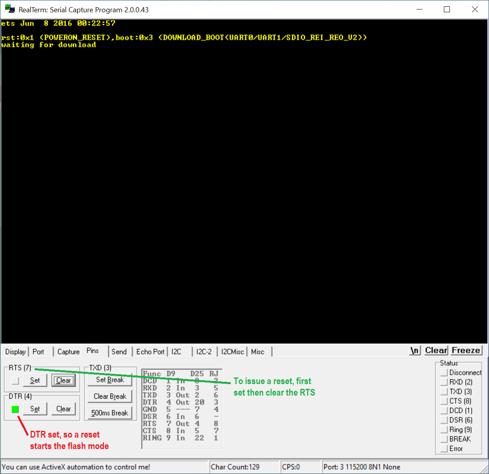

# Reset
Resetting the ESP32-CAM and transferring data.

## Introduction

I had some problems in communicating with the ESP32-CAM.
The problems are two-fold. Firstly, there is the issue of programming the ESP32. 
Secondly, there is the issue of transferring serial data while running our own application.
The two are related.

Some background. The ESP32 has a reset pin. On most boards, including the ESP32-CAM, this pin is connected to a small push button.
When the ESP32 resets, either due to a power-on or via a push on the reset button, the ESP (re-)boots. It can boot into two different programs: 
_our application_, the sketch we program in Arduino, or the _flash_ program. The flash program is build-in by Espressif. 
The flash program allows a host to send bytes to the ESP32 (via the serial link), and it will take those bytes and burn them to the ESP32's flash.
So, the flash program is used to flash our application.

In other words, upon boot, the ESP32 can be in two modes: application and flash.

The GPIO-0 pin determines whether a reset goes to application mode or to flash mode. 
When the GPIO-0 pin is grounded upon reset, the ESP32 resets into flash mode.


## Using an "FTDI" adapter

If you use a bare [ESP32-CAM with a standalone "FTDI" adapter](https://www.aliexpress.com/item/4000016600649.html), the GPIO-0 pin is not connected.
Therefore, upon power-on or when pressing the reset button, the board resets into the application mode. 
Good for normal use.

However, programming is a nuisance.
Each time you _upload_ a compiled program (from the Arduino IDE), 
you need to ground GPIO-0 and press the reset button to bring the ESP in flash mode.

That's why I made a [hardware mod](../hwmods) for that.


## Using the ESP32-CAM-MB 

If you plug the [ESP32-CAM onto the ESP32-CAM-MB](https://www.aliexpress.com/item/1005001810692306.html), you have another problem. 
The extra board has an "FTDI" adapter, the CH340G. Such a chip bridges, via USB, a serial connection from the host to the ESP32.
Such a chip not only connects to TX and RX of the ESP32, it also connects to RESET (via RTS) and GPIO-0 (via DTR).

The Arduino IDE supports this, so uploading is a breeze: no pushing of reset/flash buttons, just press the Upload in Arduino.
The IDE pulls GPIO-0 to ground (using DTR), pulses RESET (via RTS) and uploads the program via TX and RX.
Also using the Arduino Serial Monitor poses no problems; again Arduino knows about those pins.

However, a standalone terminal program has trouble with this board. 
I'm not sure why, because for ESP8266 NodeMCU boards, with a similar CH340 setup, I never had any problem.
But when I start a terminal program like [putty](https://www.putty.org/) 
it has DTR high (GPIO-0) and RTS high (RESET), so the ESP32 is stuck in reset or in the flash mode.
This is also the warning note you find at the bottom on Espressif's page on 
[serial connection](https://docs.espressif.com/projects/esp-idf/en/latest/esp32/get-started/establish-serial-connection.html).

My solution is to use one of my old favorite terminal programs [Realterm](https://realterm.sourceforge.io/).
It has not received much development attention lately. I suggest using version 2.0.0.57 from 2008-02-28
(or better, 2.0.0.70 from 2014, but it needs to be ran once as administrator for some registry keys).
This is one of the few terminal programs I know of that allows control of the RTS and DTR pins.

The screen shot below shows how to reset to flash mode.
You find these controls on the tab "Pins".
It assumes COM port, baud rate etc is set correctly in the "Port" tab.



More importantly, the screenshot below shows how to reset to application mode. 
This is of course the typical scenario for a terminal: hook up the ESP32-CAM and see or control it via serial.


A very nice trick of Realterm is that you can make a windows shortcut passing all settings as arguments.
These are my favorites, including booting to application mode with the DTR and RTS parameters when Realterm starts.

```
CAPTION=ESP32-COM3  DISPLAY=1  LFNL=1  ROWS=60  PORT=3  BAUD=115200  DTR=0  RTS=0
```

(end)
