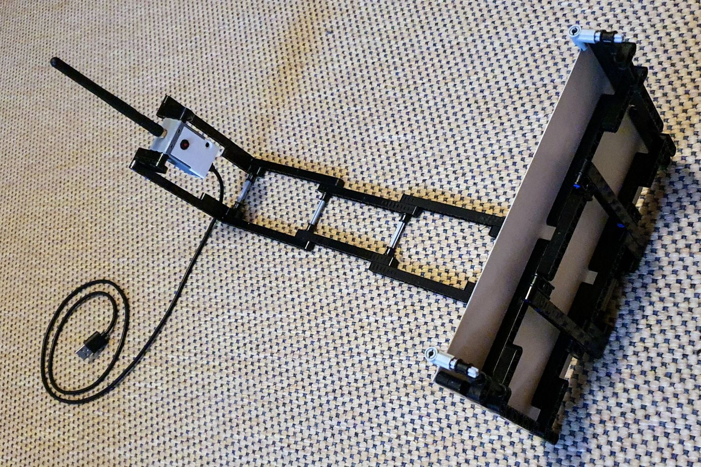

# Rock paper, scissors

My first real project with the ESP32-CAM is to use machine learning to distinguish rock, paper, scissors (and none) shot with an ESP32-CAM.
The inference is also supposed to run on the ESP32.

At this moment I completed
 - A photo rig. I first made an enclosure for the ESP32-CAM to match Lego Mindstorms Robot Inventor.
   
 - A ESP32 sketch [esp32cam-train.ino](esp32cam-train) that on a key press (CR over serial) takes a photo, 
   crops a fixed region, averages a block of 4x4 pixels into one, and dumps the pixels values over serial (in hex and as ASCII art).
 - For each of the classes (rock, paper, scissors and none) I have shot 50 photos (top later train a neural net), 
   and saved the serial output to a log file. They are saved in the [logs](logs) directory.
 - There is a python script [hexs2pngs](hexs2pngs) that converts those logs to a series of png images.
 - The images are stored in [data](data).
 
Todo
 - Add histogram stretching to `esp32cam-train.ino` to make the photos less sensitive to the environmental conditions.
 - Redo the shooting of the training set.
 - Make a convolutional neural net (CNN) - probably in my [ML](https://github.com/maarten-pennings/MachineLearning) github project.
 - Port that to the ESp32 - tried it, check my [sine](https://github.com/maarten-pennings/MachineLearning/tree/main/sine) project.
 - Maybe: connect it to the Lego Mindstorms Robot Inventor hub (serial? Bluetooth?).

(end)
